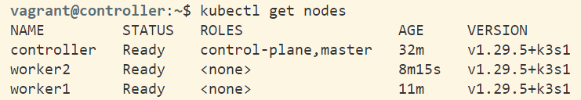

# Central Repository for Application and Cluster Operations

This repository contains all information about running the application and operating the cluster, including provisioning and deployment with Vagrant, Ansible, Docker Compose, and Kubernetes.

## Dependencies

This project relies on several other repositories for various services and libraries. Below are the links to these repositories:

- **Operation**: [here](https://github.com/remla2024-team9/operation)
- **Model Service**: [model-service](https://github.com/remla2024-team9/model-service)
- **App Frontend**: [app-frontend](https://github.com/remla2024-team9/app-frontend)
- **App Service**: [app-service](https://github.com/remla2024-team9/app-service)
- **Model Training**: [model-training](https://github.com/remla2024-team9/model-training)
- **lib-ml**: [lib-ml](https://github.com/remla2024-team9/lib-ml)
- **lib-version**: [lib-version](https://github.com/remla2024-team9/lib-version)

## Prerequisites

- **Windows Subsystem for Linux (WSL)**
- **Vagrant**
- **VirtualBox**

## Running the application with Docker Compose

To run the entire application stack using Docker Compose, follow these steps:

1. **Ensure Docker and Docker Compose are installed on your machine**. You can find installation instructions [here for Docker](https://docs.docker.com/get-docker/) and [here for Docker Compose](https://docs.docker.com/compose/install/).

2. **Clone the repository** 
   ```sh
   git clone https://github.com/remla2024-team9/operation.git
3. **Initalize**
   This command will start all the services defined in the docker-compose.yml file in detached mode.
   ```sh
   docker-compose up -d
   
4. **Access app-frontend**
To access  the app's frontend application, go to *[localhost:3000](http://localhost:3000)*

5. **Stop the services**
   ```sh
   docker-compose down

## Vagrant Setup (Windows)

### Setup

1. **Open WSL:**
   ```sh
   wsl
   ```

2. **Enable Windows Access for Vagrant (only needed once):**
   ```sh
   export VAGRANT_WSL_ENABLE_WINDOWS_ACCESS="1"
   ```

3. **Start Vagrant:**
   ```sh
   vagrant up
   ```

### Bringing Everything Down

1. **Shutdown Vagrant VMs:**
    ```sh
    vagrant halt
    ```

2. **Destroy Vagrant VMs:**
    ```sh
    vagrant destroy -f
    ```

3. **Shutdown WSL (optional):**
    ```sh
    wsl --shutdown
    ```

## Accessing Services

First, SSH into the controller:
```sh
vagrant ssh controller
```

Then, run the following commands to get the links for App-Frontend, Grafana, Kiali, and Prometheus:

- **Get App-Frontend Link**:
  ```sh
  kubectl get svc app-frontend -n default
  ```
  - **URL**: `http://<external-ip>:<port>`

- **Get Grafana Link**:
  ```sh
  kubectl get svc grafana-nodeport -n istio-system
  ```
  - **URL**: `http://<node-ip>:<node-port>`

- **Get Kiali Link**:
  ```sh
  kubectl get svc kiali-nodeport -n istio-system
  ```
  - **URL**: `http://<node-ip>:<node-port>`

- **Get Prometheus Link**:
  ```sh
  kubectl get svc prometheus-nodeport -n istio-system
  ```
  - **URL**: `http://<node-ip>:<node-port>`

## Ansible Provisioning

When running `vagrant up`, Vagrant provisions the controller and worker nodes using Ansible playbooks: `playbook_controller.yml` for the controller and `playbook_worker.yml` for each worker.

### Controller Playbook

1. **Install K3s Server**: Setup with TLS and external IP.
2. **Ensure K3s Readiness**: Wait until the server is operational.
3. **Retrieve K3s Token**: Fetch the token for worker nodes.
4. **Configure Kubectl**: Setup for local use.
5. **Install Istio**: Download and set up Istio service mesh.
6. **Enable Istio Injection**: Label default namespace.
7. **Install Monitoring Tools**:
   - **Kiali**
   - **Prometheus**
   - **Grafana**
8. **Expose Monitoring Tools**: Access via NodePort.
9. **Deploy Application**: Apply Kubernetes manifests.
10. **Setup Istio Gateway**: Configure routing.
11. **Configure Prometheus**: Apply CRDs, rules, and dashboards.

### Worker Playbook

1. **Download K3s Installation Script**: Fetch the script for K3s installation.
2. **Install K3s Worker**: Join worker nodes to the K3s server using the server URL and token.

## Kubernetes Manifests

All Kubernetes configuration files listed below are applied as part of task 8 of the controller playbook to the controller VM. These files define the deployment, services, and routing rules for the application and its components.

| File Name                      | Description                                                                                       |
|-------------------------------|---------------------------------------------------------------------------------------------------|
| **configure-frontend.yml**     | Creates ConfigMaps for frontend environment variables and NGINX configuration.                    |
| **deployment-app-frontend**    | Deploys the frontend application with NGINX, using the specified ConfigMap for configuration.     |
| **deployment-app-service**     | Deploys the backend service with specified environment variables and liveness probes.             |
| **deployment-model-service-shadow.yml** | Deploys a shadow version of the model service for testing, including metrics and liveness probes. |
| **deployment-model-service.yml** | Deploys the primary model service with specified version, ports, and liveness probes.           |
| **gateway.yml**                | Configures an Istio Gateway to manage incoming traffic to the cluster.                           |
| **service-app-frontend.yml**   | Defines a LoadBalancer service for the frontend application.                                      |
| **service-app-service.yml**    | Defines a ClusterIP service for the backend application.                                          |
| **service-model-service-shadow.yml** | Defines a ClusterIP service for the shadow model service.                                   |
| **service-model-service.yml**  | Defines a ClusterIP service for the primary model service.                                        |
| **virtualservice.yml**         | Configures routing rules using Istio VirtualService to direct traffic to the appropriate services.|

## Monitoring with Grafana Dashboard


### Key Metrics
1. **HTTP Requests per Second**: Measures the total number of HTTP requests received per second. This metric helps in understanding the current user load and demand on the application.
2. **Average Request Latency**: Tracks the average time taken to respond to HTTP requests. This metric is crucial for assessing the efficiency and performance of the application's backend.
3. **HTTP Error Rate**: Displays the percentage of HTTP requests that resulted in errors, specifically focusing on 5xx server errors. This metric is vital for detecting problems in the application that might require immediate attention.

### Loading the Dashboard in Grafana
To load the custom dashboard into Grafana, follow these steps:

1. **Access Grafana**: Log in to the Grafana UI.

2. **Import Dashboard**:
   - Navigate to the "+" icon on the left sidebar and select "Import".
   - Click 'Upload JSON file' and select the `grafana-dashboard.json` file located in the project at `/monitoring/`.
   - Click 'Import' to load the dashboard.

This will add the custom dashboard to your Grafana instance, allowing you to monitor the metrics specified.

## Troubleshooting

### Key Commands

First, SSH into the controller:
```sh
vagrant ssh controller
```

Then, run the following commands to check the status of the cluster:

- **Check Node Status**:
  ```sh
  kubectl get nodes
  ```
   Expected output:
  

- **Check Pod Status**:
  ```sh
  kubectl get pods --all-namespaces
  ```
   Expected output:
   

- **Describe a Pod**:
  ```sh
  kubectl describe pod <pod_name> -n <namespace>
  ```

- **View Pod Logs**:
  ```sh
  kubectl logs <pod_name> -n <namespace>
  ```

- **Check Services**:
  ```sh
  kubectl get services --all-namespaces
  ```
   Expected output:
   
